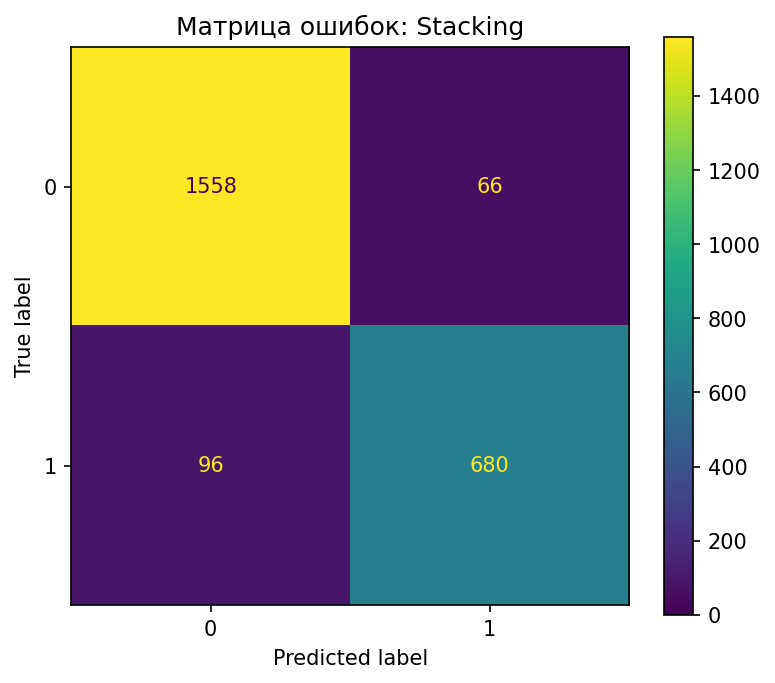

# HW06 – Report

> Файл: `homeworks/HW06/report.md`  
> Важно: не меняйте названия разделов (заголовков). Заполняйте текстом и/или вставляйте результаты.

## 1. Dataset

- Какой датасет выбран: `S06-hw-dataset-01.csv`
- Размер: 12 000 строк и 26 столбцов
- Целевая переменная: `target` бинарная классификация. Класс 0 ~ 70% (8119), класс 1 ~ 32% (3881)
- Признаки: признаки числовые (num01–num24), категориальных признаков нет. Пропусков и некорректных значений не обнаружено.

## 2. Protocol

- Разбиение: 
train/test = 80% / 20%, random_state=42
- Подбор: GridSearchCV только на обучающей выборке, 5-fold CV,  метрика оптимизировалась -> F1
- Метрики: 
   - 1Accuracy - общая оценка качества; 
   - F1-score - ключевая метрика из-за дисбаланса классов; 
   - ROC-AUC - для оценки разделяющей способности моделей, независимо от выбранного порога.

## 3. Models

- DummyClassifier (most_frequent) - наивный baseline.

- LogisticRegression (со StandardScaler) - линейный baseline.

- DecisionTreeClassifier - подбор max_depth, min_samples_leaf и ccp_alpha для контроля сложности.

- RandomForestClassifier - подбор max_depth, min_samples_leaf и max_features.

- GradientBoostingClassifier - подбор n_estimators, learning_rate и max_depth.

- StackingClassifier: из Decision Tree, Random Forest и Gradient Boosting с финальной Logistic Regression и CV=5.

## 4. Results

- DummyClassifier -> F1 = 0.000, ROC-AUC = 0.50

- LogisticRegression -> F1 = 0.708, ROC-AUC = 0.875

- DecisionTree -> F1 = 0.792, ROC-AUC = 0.895

- RandomForest -> F1 = 0.879, ROC-AUC = 0.967

- GradientBoosting -> F1 = 0.887, ROC-AUC = 0.969

- Stacking -> F1 = 0.894, ROC-AUC = 0.969

Победитель StackingClassifier, так как показал наилучший F1-score и макс ROC-AUC, при этом обеспечивая наиболее сбалансированное качество классификации.

## 5. Analysis

- Устойчивость моделей: При варьировании параметра random_state наблюдается интересная закономерность - простые модели вроде Decision Tree демонстрируют существенные колебания метрик, в то время как ансамблевые подходы (RandomForest, GradientBoosting, Stacking) сохраняют стабильно высокие показатели качества. Это подтверждает теоретические преимущества ансамблей в снижении дисперсии предсказаний.

---

- Анализ ошибок классификации: Матрица ошибок показывает эффективную работу модели с обоими классами. Для основного класса (0) достигнута точность ~ 96% (1558 из 1624 корректно классифицированы), количество ложноположительных срабатываний не превышает 4%. В миноритарном классе (1) модель корректно идентифицирует ~ 88% (680 из 776) объектов, при этом большинство ошибок относится к ложноотрицательным случаям - модель пропускает около 12% объектов этого класса. Такая картина типична для задач с дисбалансом и подтверждает адекватность выбора F1-score и ROC-AUC в качестве ключевых метрик оценки.

---

- Интерпретация: permutation importance выявила, что наибольшее влияние оказывают признаки num19, num18 и num07. Остальные признаки из топ-10 вносят умеренный вклад и повышают устойчивость модели. Распределение важности ожидаемо, что подтверждает модель опирается на информативные признаки, а не на шум, что очень выжно.

## 6. Conclusion

- F1 и ROC-AUC важнее обычной точности при дисбалансе для корректной оценки бинарных задач.

- Одиночные деревья дают разные результаты при разных настройках.

- Ансамбли работают лучше и стабильнее.

- Stacking объединяет несколько моделей для лучшего результата.

- Простые модели плохо справляются с несбалансированными данными.

- Правильная методика оценки (ML-протокол) предотвращает ложные выводы.
